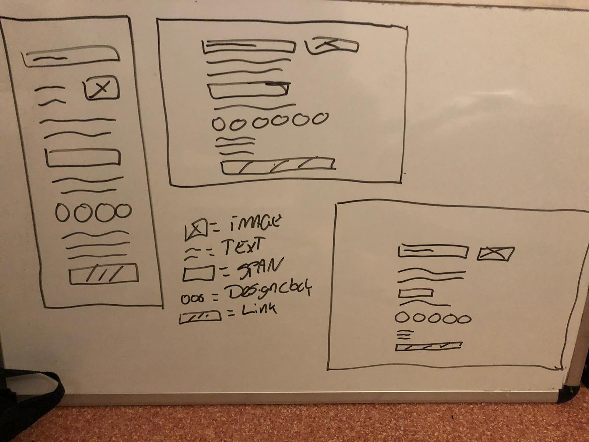
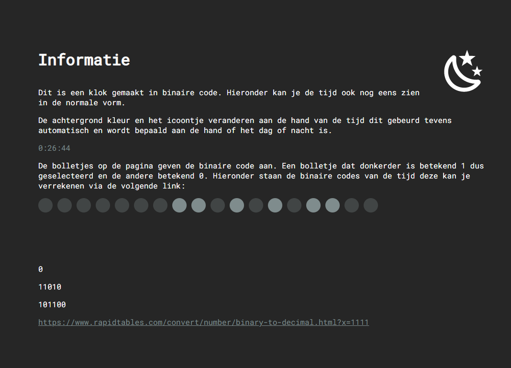
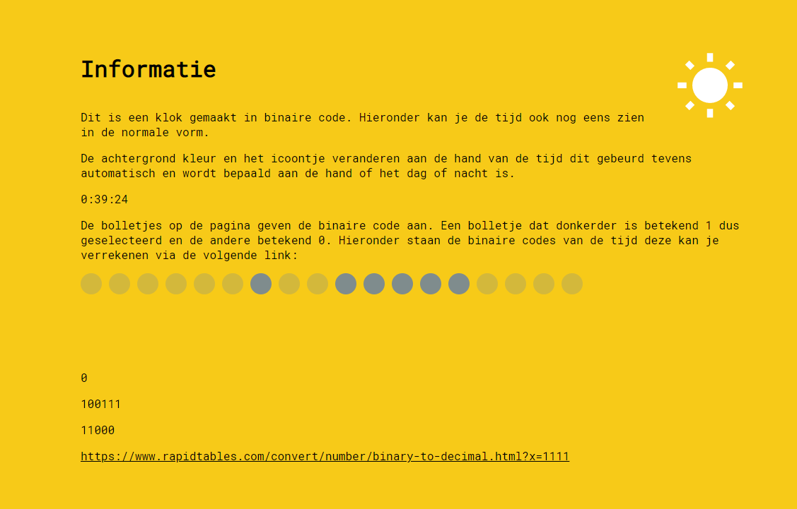

# Elon-Clock

Klok die is gemaakt heeft een twist, inplaats van de standaard getallen heb ik gebruik gemaakt van binaire code, en de klok gebouwd aan de hand van binaire berekeningen. De website bestaat uit twee versies de versie overdag en de versie snachts. Een heeft een donkere sfeer en de andere een lichte, aan de icoontjes kan je ook zien in welke tijd je zit.

Hieronder staan de schetsen, ik heb geen visuele uitwerkingen gemaakt omat ik vrij wou zijn in het coderen omdat ik niet echt een idee kon bedenken bij het maken van een binaire klok, ik vond de werking belangrijker dan het design en heb daarom ook meer tijd gestoken in het coderen dan het designen. Ik heb wel gebruik gemaakt van flex-box om alles netjes te centreren en alles in orde te houden en ook heb ik twee design types in me hoofd genomen een donker en een licht design, om visueel onderschijd te maken tussen de tijd periodes.

Hieronder staan de twee versies die nu ook live staan op de github page die is te bekijken via de volgende link: https://dinohier.github.io/Elon-Clock/

Ik heb geprobeerd om de kleuren in de toon te houden waar tesla voor staat, donker maar toch strak, voor overdag was dit best moeilijk dus heb ik geprobeerd om het duidelijk te maken dat er verschil is tussen dag en nacht.

